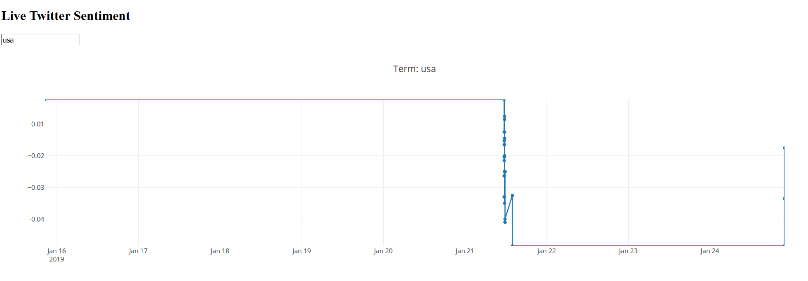

# SentimentAnalysis
Real time Sentiment Analysis on tweets streaming using the twitter API

1- You will need to setup your Twitter API on your account check this:
    
    https://developer.twitter.com/en/apps

2- Modify your consumer key, consumer secret, access token, access secret in twitterApiAnalysis.py and run it

By running the code we're going to save our tweets, sentiment, and the Unix time to our database created using sqlite (SQLite comes with Python, so you should already have it)

3- To check if everything worked well !!! simply run:
    
    readingSentiment.py

4- Finally, to vizualize your analysis run:

    dash_Sentiment.py

